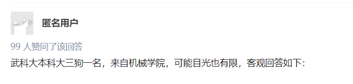
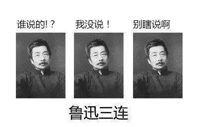
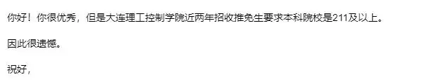
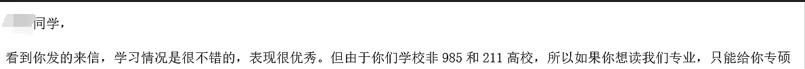
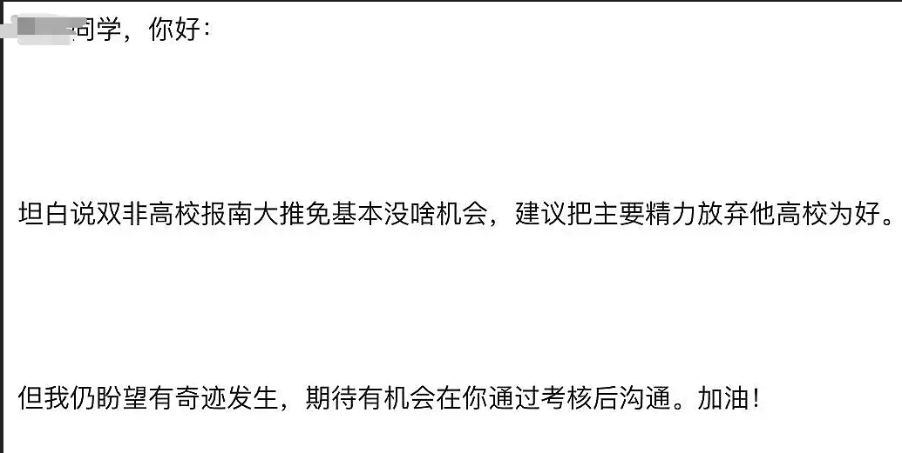
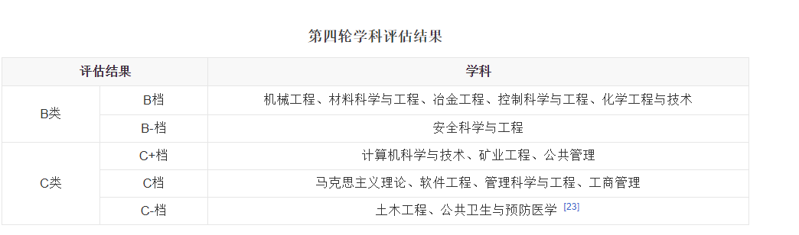
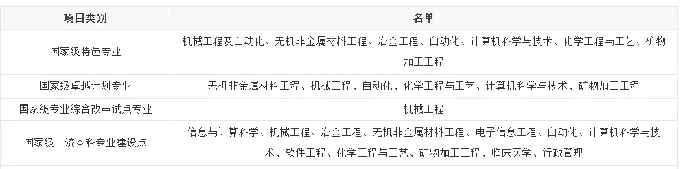
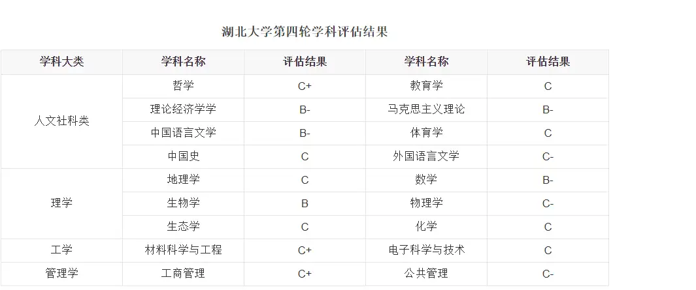
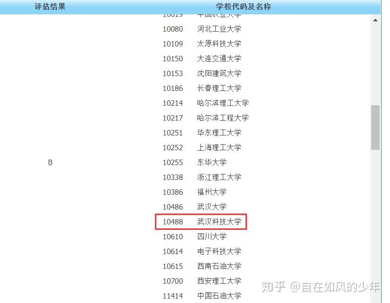

# \[17级机械 | 大疆工程师]学校情况概览

***

**基本经历介绍**

本科 武汉科技大学 机械电子工程

硕士 浙江大学 机械

岗位 大疆嵌入式工程师

知乎账号 [@自在如风的少年](https://www.zhihu.com/people/zi-zai-ru-feng-de-shao-nian-58-36)

***

我向来不喜欢任何形式的价值观输出，也希望你在看这篇回答的时候，抱着**兼听则明**的态度，认可你认可的部分，否定你不能接受的部分，每个人上大学都有自己的生活，没有哪一种生活就是对的，也没有哪种生活值得去复制粘贴般仿照。我总是跟自己说，**你听过再多的道理，心智没有达到那个境界，或者是没有经历过一些事情，你永远不会明白的。**

这篇文章发受众本以为是高考结束填志愿的学生，结果大部分是在校生和考研报名的同学，欢迎把这篇回答放进收藏夹里吃灰，**过段时间再捡起来看看**说不定有独特的感受。最后无论你是否填报武科大，选择什么样的路，都希望问心无愧。还有一个小心愿：两年以后，有机械学院学子或者其他学院的武科大学子能够在这个平台在这个问题下面阐述自己的想法。亦或是好，亦或是坏。母校愿你走的时候，挥一挥衣袖，留下你自己的一片云彩。

\-----------------以下为正文--------------------

## **一、引言**

曾经的热评第一名的是2015级机械学院的学长，现在应该就业或者读博了。多年过去了，作为2017级机械学院学弟继续回答一下这个问题。

<figure><figcaption></figcaption></figure>

想说一下**写这篇回答的动机**：大二刷知乎的时候看到不少人使用一个词:“**小镇做题家**”，就好奇看看网上怎么解释这个词：**“出身小城镇，埋头苦读，擅长应试，但缺乏一定视野和资源的青年学子”，**后来了解到这个词最早从豆瓣。

在豆瓣中，是一群自称“985废物引进计划”小组的成员，他们的小学中学是在应试教育中渡过的，“考什么，教什么”，用最为经济的教学原则和题海战术获得效用最大化的高考成绩，最终考取985名校。最让我不解的是，为什么他们考上了985，却自称是废物了？

**造成他们困扰的核心话题是对高薪职业和阶层跃升的追求，说白了就是他们觉得选错专业，他们觉得所学的专业在将来找到高薪职业和实现阶级跃升的机会很少。**小组成员按照赚钱多少或者工作稳定与否给专业分门别类，那些不能令人满意的是“天坑专业”“劝退专业”，而计算机被看作热门专业。小组部分学生中最极端的想法是，不学计算机专业，人生就是失败的。

和大部分进入武科大学子一样，我是从湖北下面县中考上来的，简短描述那时候对武科大和外界的认知：在进入大学前，还没有用过共享单车，获取外界信息的渠道停留在高中语文作文素以及父母口中的信息，[平行志愿](https://zhida.zhihu.com/search?q=%E5%B9%B3%E8%A1%8C%E5%BF%97%E6%84%BF\&zhida\_source=entity\&is\_preview=1)花了好长时间才弄明白是怎么回事，对于外界的认知基本为零。

那时候在我心中产生了一个想法，我和那些自称为“985废物引进计划”小组的成员唯一区别就是应试程度的差异，他们在高考的当时比我更会应试，去了985好大学，我当时没有那么会应试，我来了普通一本，但是我们在高考结束对这个社会的认知都是停留在最浅薄的一面。**所以我一直希望分享一下自己在大学期间见闻和思考，站在一个普通一本大学生的视角，去打破和我一样的“小镇做题家”的认知壁垒，给更多“小镇做题家”看待世界的角度，了解一下大学是什么回事，这也是我写这篇回答的动机。**关于“985废物引进计划”小组的成员的极端想法：不学计算机专业，人生就是失败的，我不苟同，我在以下专业的选择里面会阐述的。

简单介绍一下背景：

> 2017年我参加高考，当年**武科大在湖北的理科分数线537分**，**我考了539分**，可以说就是压线进学校的（2017年湖北还采用理综文综的考试方式，那年理综比较困难，导致那一年湖北一本分数线下降到484分，所以武科大校线降到了537分）。\
> 填报志愿的时候只知道我这个分数能不能上这个学校，对于专业的认识都来源于亲戚爸妈听朋友的讲解以及最粗浅的百度搜索罢了。过有**两件事情**自己心里很清楚。**第一是高考之后和一些朋友人生道路就此不同**；第二就是自己**肯定上不了这个学校分数高的专业，多半是被调剂的对象，**于是果断放弃能捡漏进去当时热门专业的幻想，压根没有填所谓热门专业浪费志愿名额，就选择几个分低但尽量避免填报那几个夕阳专业(下一节介绍什么是夕阳专业)。最后以压线的分数进入机械自动化学院[测控技术与仪器](https://zhida.zhihu.com/search?q=%E6%B5%8B%E6%8E%A7%E6%8A%80%E6%9C%AF%E4%B8%8E%E4%BB%AA%E5%99%A8\&zhida\_source=entity\&is\_preview=1)专业学习（**因为这个专业2016年才开始，往往新开的专业前几年分数都比较低，后续分数怎么样取决于这个专业未来的前景以及学校在招生的时候怎么画饼**），开启了我的大学生活。\
> 在大一上学期结束的时候转专业到**机械类**，通过前三年来自己的努力以及老师、同学和学校的帮助，以专业第一的成绩保送至[浙江大学工程师学院](https://zhida.zhihu.com/search?q=%E6%B5%99%E6%B1%9F%E5%A4%A7%E5%AD%A6%E5%B7%A5%E7%A8%8B%E5%B8%88%E5%AD%A6%E9%99%A2\&zhida\_source=entity\&is\_preview=1)免试攻读研究生。在申请浙江大学的个人陈述中这样写道，来总结我在本科的这四年：\
> 2017年9月，怀揣着对未来的无限憧憬和对梦想的执着追求，我独自一人踏上了从家乡开往武汉的火车，开启我的追梦之旅。在这难忘的三年中，从课上专注的听讲、课下穷追不舍的答疑中获得了扎实的专业基础知识；从科研项目的经历中锻炼了动手能力和学术表达能力，同时实践了基本的科研方法；从社团活动和学生工作中学会了待人处事的基本准则；从暑期社会实践经历中教会了我机械行业发展和转型的重要一课。三年来，我踏踏实实的走着每一步，力求让自己在学习和生活的点滴中成长。

本文阐述遵循“**以我为准**”原则，**不涉及到学科歧视和地域歧视等**。主要是从大家比较关心的**宏观方面**，从以下6个方面阐述：

**（1）学校层次；**

**（2）考研和就业状况；**

**（3）工资薪酬；**

**（4）转专业难度；**

**（5）学习氛围；**

（6）**学校前途。**

关于生活方面，例如宿舍有没有空调，是不是独卫，你可以加入**学院和学校新生群咨询，**在这里我就不涉及了。

## **二、学校层次**:

### **2.1 学校基本概况**

武汉科技大学是**中部四非一本高校；**

所谓**中部：**【此处无地域歧视，无地域黑，就事论事】

中国的大学在地域上可以简单划分为：一线城市（有且仅有四个：北上广深）、东部南部沿海城市（例如杭州、南京、厦门、宁波等）、中部、北部内陆城市（武汉、郑州，长沙，成都，西安，长春，沈阳等）、西部城市（银川、乌鲁木齐等）。

同一层次的学校，所在区域在**一线城市的、沿海的分数就是要比在内陆城市的分数要高**，因为前者所在区域的经济活力明显高于后者，前者所在区域带给学生的眼界和资源是高处后者的，高出来的这部分分数称为地域溢价。这个溢价每年困扰着无数填报高考志愿的考生。例如部分地区的985的投档线和沿海地区211线一样，前几年知乎上由考生提问选择吉林大学（985）还是[上海大学](https://zhida.zhihu.com/search?q=%E4%B8%8A%E6%B5%B7%E5%A4%A7%E5%AD%A6\&zhida\_source=entity\&is\_preview=1)（211），这样类似的问题层出不穷，我个人的看法是这个溢价对每个专业的增益大不一样，**例如像金融、会计得到的收益明显高于传统工科类**，因为这些区域给学生更多就业和实习机会。武汉作为一个中部地区新一线城市，在疫情之前势头就很猛，可谓是举全省之力发展，在疫情之后发恢复也很快，比起接壤的几个省的省会（长沙、郑州、南昌），武汉的发展普遍预估更好。但是相比于沿海城市（南京、杭州），还是有差距。因此我认为选择工科专业在武汉读大学是一个不错的选择。

不过挺多学生在填报志愿的时候只考虑离家近这个因素，可以常回去玩一玩，不过随着疫情反复封校成为常态，离家远近已经变得玄乎缥缈，还是趁着年轻选择一个性价比最高的城市，毕竟大学所在城市可能会影响毕业后前几年的去向。

所谓**四非**：

非985、非211、非一流学校、非一流学科。2017年我考入武科大的时候还是个双非（非985、非211），直到**2018年**教育部才公布**第一轮双一流名单（一流学校、一流学科名单）**，**2022年**教育部公布**第二轮双一流名单**，很可惜这两轮名单里面**都没有**武汉科技大学，所以武汉科技大学被自己学生自黑为“四非”。不过需要指出，之前的985和211全部继承了双一流，在此基础上还增加了一些普通一本学校，所以双一流的蛋糕越来越大，武汉科技大学在第三轮学科评估中入选双一流的机会大吗，我在学校前景这一块会阐述一些想法。

> **其实没有所谓的四非，双非自黑的人多了也变成了四非。——鲁迅**

<figure><figcaption></figcaption></figure>

* **学校排名**：学校排名在全国120上下浮动。2018年正值学校120周年校庆，当年教务处下发的校庆材料上制定的目标是争取在**2020年实现全国100强**。（在部分大学排名榜单中，学校偶尔达到过这个高度，但是如果长期稳定在这个高度，得靠各位后浪们不懈努力。）

我给各位提出几个观点：

（1）我们纠结的**不是**这个大学在某个榜单的**具体排名**，**而是**他的**排名区间**，**进而得到他的层次。**

**因为同一层次的学校给学生的兜底机会基本一样，他给你的下限一样。**在同样一个层次的学校内，学校间无论是教学水平、科研能力、知名度、学校实力的方差很小，而**这些学校内部学生之间的方差远远大于这些学校间的方差**。因此无论你的选择如何，只要在这个区间内都不会差，学校可以为你兜底。但你自己进入大学之后的**努力和选择**会给你的人生影响很大，**这些东西决定你的上限**。不要再纠结在某某榜单上面某某大学是101名，某某大学是102名，因此你产生101名大学的毕业去向一定好于102名的荒谬想法；也不要去看百度首页[百家号](https://zhida.zhihu.com/search?q=%E7%99%BE%E5%AE%B6%E5%8F%B7\&zhida\_source=entity\&is\_preview=1)写的_**某某榜单上A大学排名（90名）首次超过B大学（100名）,A大学实力碾压B大学**_这种月经文，这种文章纯属满足观众猎奇，毫无营养。

我认为在**同一城市类型，学校学科布局相差不大**的情况下，榜单排名±15名左右的两所学校的毕业生毕业总体去向都是在相同水平，而学校学生内部的方差就天差地别。

**（2）排名的本质就是降维。降维就是信息压缩以及信息损失的过程。**

衡量一所学校好坏，原本需要使用一万个维度，但是为了让大众理解方便，我们把它降低到一个维度，于是大家看不懂的专业信息以及大家懒得看的细节信息都被忽略掉了，只留下一个简单的1至1000之间的自然数，于是所有人感觉一眼就能看明白了。但是此看明白非彼看明白，对于外行而言，这个数字值很简单，可以是饭后的谈资，也可以是告诉你除了学习什么都信息都不要接触的父母帮你填报志愿的“依据”。但是对于专业人士而言，不论是填报专业决定自己未来的考生还是校招的聘用单位，肯定还是需要参考被压缩以前的信息。

这就解释了为什么上财（211）、北邮（211）在一些排名没有一些中流985高，但是他们的高考分数线比一些中游985的分数线还要高，因为他们吃行业的红利，他们优势专业学生出来的薪资就是比中流985普通专业的薪资普遍要高。所以在看排名数字的时候也要看到行业红利，地域等背后的影响。

那问题来了，怎么看一个大学的排名区间了？我个人推荐的判断依据是国际四大知名大学排名榜单：QS、Times、ARWU和US NEWS。

各种排名榜单必然会受到各种批判的声音，但是这四个榜单是各省组织部在选调公务员官方采用的榜单，再不济也是官方认可的。查看近三年某某大学在四个榜单的排名，**求出平均值**，就可以了解这个学校的层次以及发展趋势，如果这个大学在10名左右浮动完全正常。

以**武汉科技大学**为例：

**英国QS世界大学排名**_**(**QS World University Rankings )：_

2020年：榜单仅显示世界前1000名，**未上榜**

2019年：榜单仅显示世界前1000名，**未上榜**

2018年：榜单仅显示世界前1000名，**未上榜**

\
**英国**[泰晤士](https://zhida.zhihu.com/search?q=%E6%B3%B0%E6%99%A4%E5%A3%AB\&zhida\_source=entity\&is\_preview=1)**世界大学排名**_(THE World University Rankings )：_\
2020年：榜单仅显示世界前1000名，**未上榜**

2019年：榜单仅显示世界前1000名，**未上榜**

2018年：榜单仅显示世界前1000名，**未上榜**\
\
**美国US News世界大学排名**_**(**Best Global Universities Rankings**):**_

2021年：**111名**

2020年：**121名**

2019年：**108名**

2018年：**114名**

2017年**：135名+**

再来看看国内比较有名的大学排名

\
**中国软科**[中国大学](https://zhida.zhihu.com/search?q=%E4%B8%AD%E5%9B%BD%E5%A4%A7%E5%AD%A6\&zhida\_source=entity\&is\_preview=1)**学术排名**(Academic Ranking of World Universities )

2022年：**107名**

2020年：**114名**

2019年：**131名**

2018年：**137名**

2017年：**148名**

[校友会](https://zhida.zhihu.com/search?q=%E6%A0%A1%E5%8F%8B%E4%BC%9A\&zhida\_source=entity\&is\_preview=1)**中国大学排名**

2020年：**100名**

2019年：**171名**

2018年：**149名**

**综合国内和国外大学排名，武汉科技大学排名在逐年提升，近几年基本维持在110-120左右。**

* **招生人数**：每年招收人数为**6000余人，省内生源占2/3，省外占1/3。**（2020年招生人数6404人，其中湖北生源4100人左右，外省生源2300人左右），这就是造成一个很有趣的现象，大学一个班大概30人上下，10多个省外同学，20多个湖北省内同学。
* **分数线**：从16年开始，**湖北省理工科分数线**一直稳定在湖北**25000－26000排名**。外省同学可以查看武汉科技大学本科生招生网查询最近几年的分数线。

2020年湖北理科分数线555，排名27432；

2019年湖北理科分数线555，排名26700；

2018年湖北理科分数线564，排名26350；

2017年湖北理科分数线537，排名26126；

2016年湖北理科分数线564，排名26126。

（虽然近几年湖北分数排名逐年略微有下滑趋势，但是可以看到最近5年湖北一本人数较大幅度上升，同时武科大这几年招生人数也逐年上升，感兴趣的同学可以计算一下**武科大最低分排名与湖北一本线排名的比例，**这个比例反应了你在当年湖北一本中排名前百分之多少。）

例如我高考（2017）那年，比例：26126/51271=50.96%；

再举个2020年，比例： 27432/54896=49.97%。

从这个比例可以看出武科大在湖北的最低分基本稳定在当年一本的前50%左右。我提出一个观点：**只要高考填报志愿方式不发生根本性变化（平行志愿维持不变），武科大没有进入教育部双一流名单**，武科大在湖北的分数线不会发生大的变化，处于并将长期处于一本分数的前50%。

[武汉科技大学本科招生网zs.wust.edu.cn/bk/](https://link.zhihu.com/?target=http%3A//zs.wust.edu.cn/bk/)

### **2.2 报武科大亏吗？**

* 如果你是平常人，资质天赋一般，如果你的排名可以达到一些地域比较好的211（沿海、一线城市），但是压线，怕调剂到一个差的专业，我建议你深入了解下这些211学校转专业难度。转专业难度没那么大，同时你下定决心转专业，我强烈去这些更好的211，来武科大就亏了。**因为一个积明确的目标加上好的学校加上地域优势，可以决定你的眼界，决定你未来四年接触的是什么人**。因为**专业可以转，但是学校不能换**。你可以通过努力去转专业，但是你的努力不能改变你的本科出身；如果转专业难度比较大，同时你转专业意志不坚定的时候，感觉大部分专业都可以学的时候，我建议你来偏远211选择热门薪资高的专业，你可以趁着年轻吃这个行业的红利，拿几年高薪资。

<figure><figcaption>
这是我申请大连理工学院控制学院老师的回复
</figcaption></figure>

<figure><figcaption>
这是我申请华中科技大学机械学院老师的回复
</figcaption></figure>

<figure><figcaption>
这是我申请南京大学老师的回复
</figcaption></figure>

* 如果你的排名仅仅只能到达一些**偏远地区的211**同时也可以达到**本校未来发展比较好的专业**（哪些专业未来发展好，自己去做些功课）。我给你说一些各方面的利弊，至于最终你选择什么相信你心里有把称。

> **总体概述**：偏偏远地区的211往往是一些政策性的211，国家为了**平衡教育资源**，每个省必须要设有一个211。211一共设立的数量是116所，你可能在一些大学排名榜单上面看到某某211在116开外，这也是很正常的。**如果在你目前的认知里面，如果一个211出对你身更重要，就去选择它;如果你觉得一个211是一个不错兜底的未来，你就去选择它。**\
> **专业分析：**离开专业谈学校就是耍流氓。**医学、农学、艺术学先看地域；工科重专业排名；社会人文学科重学校。**\
> （1）对于想学医学和艺术学的同学来说，如果不打算深造实现地域飞跃，基本哪里读书哪里就业，相关性很大。武汉作为一个新一线城市，区域辐射中心，相比于某些偏远地区发展会好一些；（**此处无地域歧视，就事论事**）\
> （2）对于工科来说，以机械工程专业为例，好的学校可以教你设计一个很复杂很精密的自动化车床，一个一般的学校只能教你设计一个普通车床，这就是你给未来企业或者社会创造价值的体现。如果你打算报考工科，我这边建议你需要关注这些偏偏远地区211的专业排名。武科大机械工程在全国排名是40多，教育部学科评估B(关于这个学科评估下面有详细介绍)，如果偏远地区211的排名靠近(处于同一评级)，建议选择偏远211；如果排名相差较远(一个b，一个c)，建议选择武科大。（**此处无地域歧视，就事论事**）\
> （3）如果你是[人文社科类](https://zhida.zhihu.com/search?q=%E4%BA%BA%E6%96%87%E7%A4%BE%E7%A7%91%E7%B1%BB\&zhida\_source=entity\&is\_preview=1)专业，一个偏于地区的211对你学历夹持是个不错的选择，建议选择它。

这是[张雪峰](https://zhida.zhihu.com/search?q=%E5%BC%A0%E9%9B%AA%E5%B3%B0\&zhida\_source=entity\&is\_preview=1)老师关于专业、学校、地域的观点，我个人比较认同，他是这方面专业辅导老师，可以作为观点参考。

[专业、学校、地域重要性weibo.com/1676679984/HxmdpqS38](https://link.zhihu.com/?target=https%3A//weibo.com/1676679984/HxmdpqS38)

（3）如果你的排名仅仅能够达到武科大校线或者超出10分左右，武科大在这个分数段是个性价比不错的选择。

在这个分数段，你经常会看到网上有很多武科大与其他大学比较的问答。例如：在**湖北省内**，和湖北大学、中南民族大学比较、[湖北工业大学](https://zhida.zhihu.com/search?q=%E6%B9%96%E5%8C%97%E5%B7%A5%E4%B8%9A%E5%A4%A7%E5%AD%A6\&zhida\_source=entity\&is\_preview=1)比较;**在湖北省外**，经常和成都理工大学、[湘潭大学](https://zhida.zhihu.com/search?q=%E6%B9%98%E6%BD%AD%E5%A4%A7%E5%AD%A6\&zhida\_source=entity\&is\_preview=1)比较。遇到这种抉择，可以参考知乎上答主的回答，但是要辨别主观评价和客观描述的区别：

* 那些说\*\*学校硬件条件好，在我看来不是决定性因素，分清主次，只是其中因素之一，不要捡芝麻丢了西瓜；
* 那些说某某大学实力碾压另外一所，高考考生是最现实的，那为什么分数线常年在一个档次，人家都是傻子选“被碾压”的学校吗；

分数线差不多，整体实力不会相差太大，细化为下面的专业就一定有所区别，决定你的是你四年要读的专业。我提供一个解决问题办法，因为我是工科生，凡事我都尽量想一个量化方式，**离开专业谈学校就是耍流氓**，在分数段相近的前提下，我建议以学科优势作为评价进行选择，核心的两个评价指标是：

**（1）教育部第四轮学科评估**；

**（2）一流本科专业建设点**。

**武汉科技大学百度百科：**

<figure><figcaption></figcaption></figure>

<figure><figcaption></figcaption></figure>

**湖北大学百度百科：**

<figure><figcaption></figcaption></figure>

从**第四轮学科评估**以及**一流本科专业建设点**两个关键数据分析，武科大的优势科目在于工科，后者湖北大学的优势以人文社科为主。根据**自己的分数排名**结合**自己兴趣**和**行业发展前景**匹配这些**优势学科**，相信你自己心里也有选择。

（3）再说一下我们学校的专业：

* **你们学校的专业什么见长？**

**答案：工科见长**。

从上面的湖北大学和武汉科技大学对比我就提到了这个答案。凡是名字中带有**科技、工业、理工的**大学，往往**工科**都是这个学校的强势专业（需要指出的是，在大学专业中**工科和理科**是两个不同的学科。**机械学院、计算机学院、信息学院、材冶学院、化工学院、资环学院**等大部分专业都是工科，这些专业的同学工作后大部分都是实际应用领域的，就业走单纯的学术研究路线的不多，这就是工科的特点；而理科专业，例如[信息与计算科学](https://zhida.zhihu.com/search?q=%E4%BF%A1%E6%81%AF%E4%B8%8E%E8%AE%A1%E7%AE%97%E7%A7%91%E5%AD%A6\&zhida\_source=entity\&is\_preview=1)**(俗称数学专业)、统计学**等以后就业偏向学术研究路线（例如科研所，高校教书）的比例，这也是理科的特点。但以上划分并不绝对和精确，目的是给你一个大致的了解。

* 你们学校**具体**有哪些**王牌专业**？

三年前在选择专业的时候，我也在思考这个问题，人的本能就是往资源好方向去靠。我希望你在考虑这个问题的时候，不要用单线程的思维去考虑，你心中的王牌专业应该是一个[综合评价](https://zhida.zhihu.com/search?q=%E7%BB%BC%E5%90%88%E8%AF%84%E4%BB%B7\&zhida\_source=entity\&is\_preview=1)**指标。**

具体来说，你可以把它进行一个量化。评价指标包括：

**(1)这个专业未来的发展就业前景**

**(2)你感兴趣的程度**

**(3)这个专业在全国的排名等等**。

即**热门学科+自身因素+优势学科**。把每个评价指标进行加权，每一项打分都在0－1区间，至于每个指标的权重的大小相信你自己心里有一把秤，最后计算综合得分。

我们学校的前身是[武汉冶金科技大学](https://zhida.zhihu.com/search?q=%E6%AD%A6%E6%B1%89%E5%86%B6%E9%87%91%E7%A7%91%E6%8A%80%E5%A4%A7%E5%AD%A6\&zhida\_source=entity\&is\_preview=1)，当然钢铁冶金也行这一块儿是我们的强项。但是随着[第三产业](https://zhida.zhihu.com/search?q=%E7%AC%AC%E4%B8%89%E4%BA%A7%E4%B8%9A\&zhida\_source=entity\&is\_preview=1)(服务增值行业，例如餐饮、金融、科技)在GDP中的比重逐渐增大，就出现所谓的**夕阳产业和**[朝阳产业](https://zhida.zhihu.com/search?q=%E6%9C%9D%E9%98%B3%E4%BA%A7%E4%B8%9A\&zhida\_source=entity\&is\_preview=1)。夕阳产业这几年能不能一个合理的转型，朝阳产业在五年之后是不是还是朝阳产业，这个专业的人才缺口多大或者说是否达到饱和？这个行业工资高但是工作强度大，你能不能承受？这都是需要你去做功课的。例如，某个专业是优势学科(排名靠前)，但是这几年发展不好；某个专业社会普遍认可前景较好，但是你不敢不感兴趣；所以我并没有直接回答具体哪些专业是王牌专业，我只给了你**一个评价它的方法**。

* 我在哪看我这个专业的**官方权威排名**？

如果你想了解准备报考的专业在全国处于什么排名，主要参考一个官方权威排名:

[全国第四轮学科评估结果公布www.cdgdc.edu.cn/xwyyjsjyxx/xkpgjg/](https://link.zhihu.com/?target=http%3A//www.cdgdc.edu.cn/xwyyjsjyxx/xkpgjg/)

作为一个准大学生，要慢慢学会找到**有用信息。**不要做出这种傻事：打开百度，搜索某某专业[学科排名](https://zhida.zhihu.com/search?q=%E5%AD%A6%E7%A7%91%E6%8E%92%E5%90%8D\&zhida\_source=entity\&is\_preview=1)，点击前面几个结果。这是典型的没有受到社会的毒打。要知道百度前几名都是一些营销号为了KPI(绩效指标），随便写一段话上去，其实你也可以注册一个百度百家号，然后把某某大学某某专业放在全国前\*\*名，然后配上几张美丽的校园照片，这时候涉世未深的你就盲目相信，恭喜你成功上当。

言归正传，给大家解释一下**教育部第四轮学科评估是什么**。**教育部学科评估**是**教育部学位中心**，对全国具有博士或硕士学位授予权的[一级学科](https://zhida.zhihu.com/search?q=%E4%B8%80%E7%BA%A7%E5%AD%A6%E7%A7%91\&zhida\_source=entity\&is\_preview=1)开展整体水平评估。2002年首次开展，截至2017年完成了四轮。每五年一次，评估结果按**“分档”**方式呈现，将前70%的学科分9档公布：**前2%（或前2名）为A+，2%～5%为A（不含2%，下同），5%～10%为A-，10%～20%为B+，20%～30%为B，30%～40%为B-，40%～50%为C+，50%～60%为C，60%～70%为C-。**下图是**武汉科技大学机械工程**在第四轮学科评估中是**B**。我们自己开玩笑说和武汉大学、四川大学等985属于同一档次。(当然也是说说而已，其实我们心里都有数，拿我们擅长的专业和别人不擅长专业比没有任何意义，毕竟武大机械和武科大机械本科生毕业的薪资、出路和眼界就不一样，虽然武汉大学机械是B，但是他们本科和研究生出来的中位数工资远高于武科大机械研究生)

<figure><figcaption></figcaption></figure>

* 刚刚高考完，对于专业一点认知都没有，有些专业我压根没有听过，面对眼花缭乱的专业怎么选？

当然你也不必过分纠结选什么专业，上面提出的三个综合评价指标((1)这个专业未来的发展就业前景(2)你感兴趣的程度(3)这个专业在全国的排名**)**很大程度取决于你的主观因素和现在的认知，例如：

（1）你高中生物，化学科目特别好，想去学习某某专业；

（2）你的爸爸妈妈可能说，某某亲戚之前读那个专业，现在混的特别好，你赶紧读这个专业；

（3）......

趁着还没有到填报志愿的最后期限，让父母给你推荐他们圈子各行各业的**普通劳动者的联系方式**，你本人亲自找一个时间段跟他们聊一聊他们从事行业的生活方式，语气放礼貌一点，相信他们很愿意和你交流的。除了所谓几个不劝退专业，其他专业的普通劳动者应该都会负面评价，这个不重要，重要的是几个核心问题：

（1）你当时为什么从事这个专业？（2）你现在想放弃的原因是什么？

（3）现在工作最快乐的地方是什么？（4）现在工作最悲哀的地方是什么？

如果劝退的原因仅仅是羡慕其他行业平均薪资，悲哀的仅仅是钱不够多，但是工作强度比较温和，能够养活自己，可以结合自己家庭背景，抛去那三个综合评价指标，从感性角度进行分析，在填报志愿短暂思考下人生，你一生为之追随的究竟是什么——

* 如果家庭条件比较好，你可以为自己的梦想去追寻，没有必要看什么热门学什么。前段时间我跟同学交流十年后你认为“成功”的概念，他觉得从农村到小县城居住即实现所谓阶级跳跃，借助本校研究生学历在本地找个工作养家，利用他擅长的人际交流就可以实现资源的整合，对他来说北上广深就未必是正确的选择；家里能在你毕业之后给你掏钱交完首付的话，你可以随意选择你喜欢的。
* 如果你家庭条件一般，想要实现经济独立，且你目前价值观内钱最重要，工作累点没有关系。**工作就是为了赚钱，赚钱就是为了快乐**，我建议去选择现在风口好的专业。这不可否认，同样的本科出生不同行业的平均工资少则有几千块钱的差别。刚进大学的你需要认清楚一件事情，普通人想拿高工资那必定是热门行业+加班拿到的，再别幻想着钱多事少的工作，你是普通人为什么这种事情会让你碰到了。
* 人和人天生就是不一样的，有的人出生就在罗马，有的人出生就是牛马，同时这个社会从来没有跟你说过以后的薪资就跟高考分数挂钩，可能有些人考了三本毕业之后继承父业雇佣一个武科大研究生去给他打工，听他颐指气使的使唤。这都是很正常的事情，我没有办法改变自己出生命运，我可以选择不在他家公司干，况且人生评价指标也不仅仅是薪资一个维度，真正的英雄主义是看清生活真相之后仍然热爱生活。

同时，因为每个专业都有正数第一和倒数第一的同学，学长给你一个寄语，希望你更多靠自己努力而不是单纯去享受行业的红利。选择一个你认为合适的专业加上你自己的努力是这个年龄段值得你去思考的；同时学长也希望刚刚迈入大学的你改掉学生时代的一些想法——（1）我高考分数比\*\*同学高多少分进来，心里有种优越感（2）总拿高考发挥失误挂在嘴边（3）摒弃小镇做题家的思维。

* 大家都是武科大，你凭啥瞧不起人家？你的资本是什么？来到这里，就意味着高考为你抹平了一切，四年生活给你无限翻盘机会，也给你无限堕落机会；你可以利用三年不懈努力在这里争取前2%的保研率申请985高校实现学历飞跃，你也可以借助武科大这个平台本科毕业就利用自己硬实力去大厂找一份令人羡慕的工资；这里提供了梦想成长，人生出彩，和未来一同成长和发展的机会，也见证无数同学的荒废的四年。趁早放弃这种优越感。
* 资本家不会在意你高考发挥失常还是超常，在意你为他创造价值的能力，而这些能力就是你四年点点滴滴的努力和改变。天天将发挥失常挂在嘴边，最后可能变成令人厌恶的[祥林嫂](https://zhida.zhihu.com/search?q=%E7%A5%A5%E6%9E%97%E5%AB%82\&zhida\_source=entity\&is\_preview=1)。
* 计算机专业同学千万不要鄙视生化环材机械土木地矿油等天坑专业的学生，这些专业学的知识绝对不比计算机专业课要简单，也绝对没有天坑专业高深多少，计算机之所以能拿比天坑专业多几倍的工资就是因为行业风口，10年前旧基建热门的时候土木也是如此热门，再看看如今土木学生出去就业环境是什么鬼样子，专业的迭代是一轮又一轮，也没有人会预料下一个风口是什么，玩鄙视链的迟早会被反噬。所以赶紧在优质赛道上趁着年轻多赚几年钱吧，并培养快速自学能力，我认为这个才是最重要的。

下面一段话是我自己一些感触，仅作分享，作为第一大板块的结束：

我一直认为个人成长与人生选择过程中有三个悖论:16-18岁在对学科与知识一无所知的时候就被要求选择自己的专业;22-25岁在对商业世界运行规则毫无概念的时候就被要求选择工作方向;25-28岁在对自己和人际关系一知半解的情况下就被要求确定长期伴侣;这样想来，其实人生出问题是一个大概率事件。

二、考研和就业情况

你要我回答“学风好”或者“学风不好”我觉得我回答不了，我觉得用**你更应该用自己的分数和自身实际情况结合武科大的分数线来评估下生源**，进而判断学风是怎么样的比较合理且合适。毕竟硬要说的话，清北也有逃课的人，大专也有上进的人，但是高考的本质其实就是把层次相似的学生聚类到一个地方学习，所以说**你是什么样的学生，你的周围的学生也大概率也和你是一样的**。（±10分高考差距）
