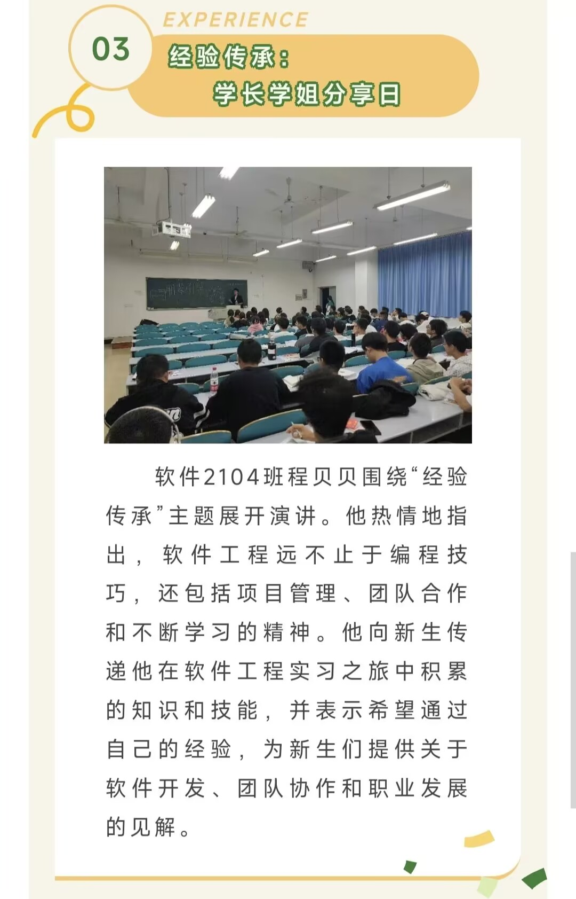
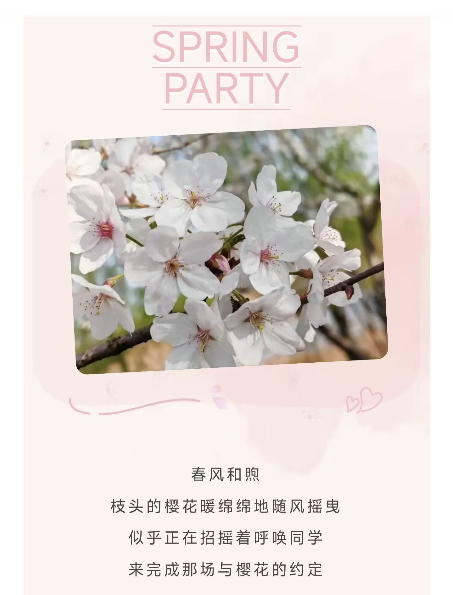
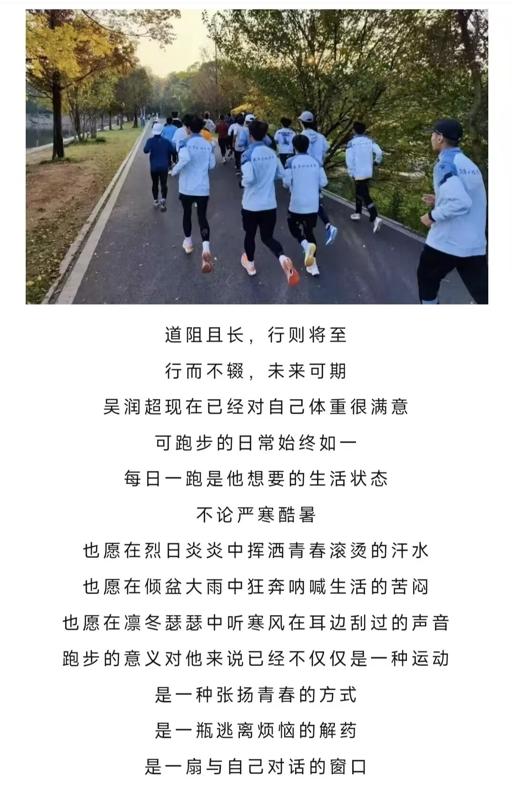
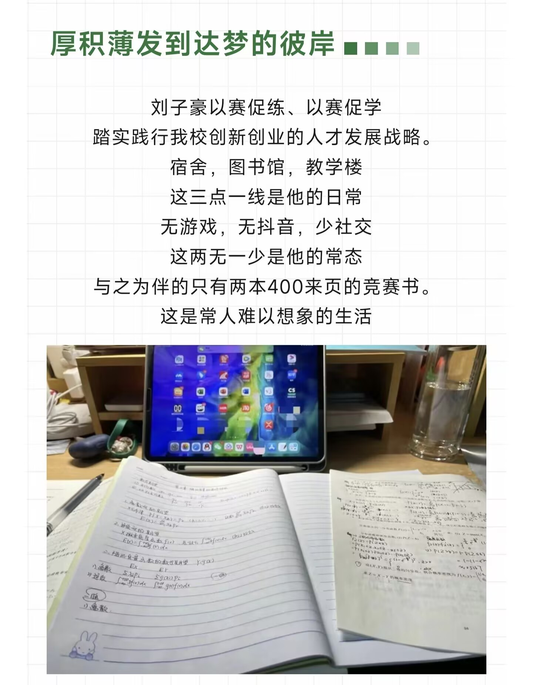
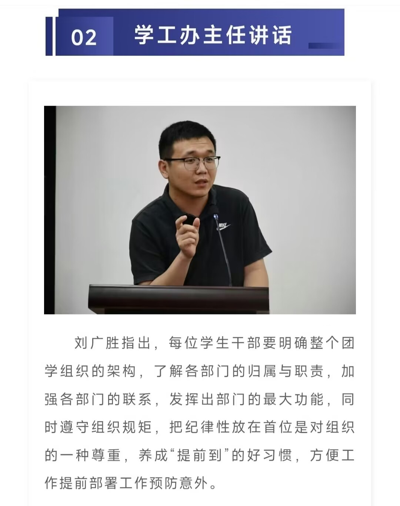
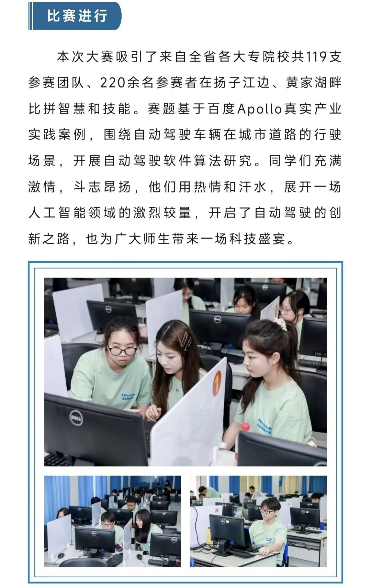
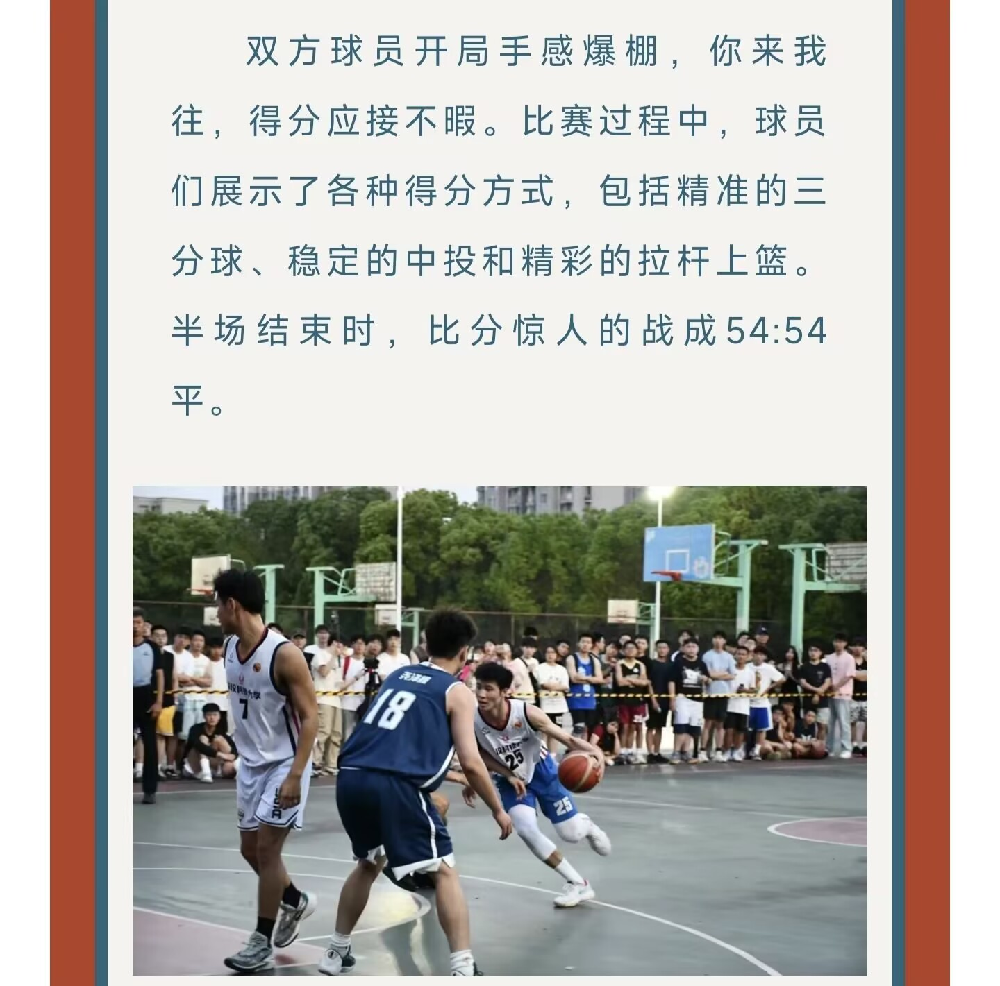

# \[23级计算机]一位新媒体人的自传

## 初识

刚进大学的我，还是个懵懂的傻小子，根本不清楚周边发生的事情是怎么回事。就像我进新媒体那会，我甚至都不知道是个院级学生组织，后来还傻傻的问别人，那怎麽进校级学生组织，别人只淡淡地回答道：“前段时间南苑食堂搭的棚你没去看看吗？”这时候我才恍然大悟，原来每天吃饭匆匆路过的大棚和热情发传单的学长学姐就是在为校级招新。我……（一整个无语住）

于是，错过了校级招新，我浑然不知地坐在沁湖礼堂听学院学生组织的招新宣讲会。当然，坐在凳子上的这位傻小子其实脑子里根本也不了解学生组织的架构，只是看着台上一个个部门的部长上去又下来。终于，新媒体登场了，站在台上的这位部长我倒是很有印象，军训时就经常看见他到处拍照。他的一句“部门能参加学院所有活动”让我萌生了加入新媒体的想法，因为我想在大学里能多多参加活动，玩的开心的同时也能认识更多的人。于是，我报名参加了面试和笔试就开启了新媒体之旅。

***

刚开始的部门工作也算顺利，掌握了基本的排版功能，一些简单的推文对着现稿也能排得规规整整。

> [“计”日起航 | 计算机学院新生入学教育系列活动——鹏辈引导：倾心分享生活工作](https://mp.weixin.qq.com/s/21tMYeNkd1003jUkYI4FOg)

<figure><figcaption>
一个模板用到底
</figcaption></figure>

后来，我们部门是两名部员合作一篇推文，一人写稿，一人排版。可其实我不是一个好的写手，每次我写稿时，经常是抓耳挠腮，苦思冥想，好不容易才能流利完整地表达清楚意思。轮到我排版的时候，我也不是每回都很轻松，我也总会想绞劲脑汁去排好版。那时候我效率低下，总是思来想去拿不定主意，单排版和写稿也能要一两个小时，最终却只能呈现一般的效果。

> [“计”日起航 | 英语学习小妙招 升学规划全解析](https://mp.weixin.qq.com/s/tFo8BZw0QrnyGBzn-HxaLw)

<figure><figcaption>
就这点表达我当时也要花很长时间
</figcaption></figure>

***

## 成长

一切的改变从“樱花派对”这篇推文开始，这篇推文是下了点苦功夫，当时在图书馆泡了一下午加一晚上，开始用电脑写是写了又删，后面特意到去商店买纸笔，可还是一段也没写出来，时间转眼就到傍晚，思考过多导致我经不住睡意的侵袭，醒后又在小红书上看各种文案寻找灵感，“春有约，花不误，年年岁岁不相负。”一个个这样的句子终于让我找到属于自己的表达，进入心流状态，文思泉涌，一气呵成，这篇推文也终于是完工了。

> [半盏春光 共会此时——春日樱花派对](https://mp.weixin.qq.com/s/bwVNtQUbrzDAapb\_i6EaiQ)

<figure><figcaption>
真的熬了很久
</figcaption></figure>

后来，我又做了一篇进阶plus版推文。这是一篇人物推文，也和当时做“樱花派对”推文一样，一下午的苦思换不来一段完整的文稿，只有在灵感爆发的瞬间才正式宣告创作的开始，简约的样式突破模板的限制，工整的排笔配上居中的格式尽显文字之美。在那一刻，我的推文似乎有了质的飞跃，开始有了感情温度而不是冰冷的文字描述着无趣的事实，我也获得一种用心创作的成就感，这也许就是我留任新媒体部长的原因。

> [“纵有疾风起，人生不言弃” —— 一名追风少年的故事 || 计科芳华录](https://mp.weixin.qq.com/s/0lm87GMzfgxV29YNbZb2VA)

<figure><figcaption>
现在看看也觉得写得挺好的 感动 呜呜呜
</figcaption></figure>

这种风格后面运用在刘子豪人物推文里达到了最好的效果，这篇的文案是刘学长写的，这位大佬的文案质量比我高很多，再加上他给我提供了很多图片素材，这就极大地激发了我的兴趣和热情，因为我很愿意花心思研磨出高质量的推文。制作的过程中，我一直干劲十足，一路高歌，不再像以前一样苦恼，但也并不容易，挑选合适的样式，规划全局的排版还是很花心思的。

> [我院学子刘子豪荣获2024年武汉科技大学校长奖章](https://mp.weixin.qq.com/s/U3D8O12433Q\_rJ-n4HdAyw)

<figure><figcaption>
被另一个部长夸过 阅读量在当时也创下新高
</figcaption></figure>

就是在这样一篇篇的磨砺下，我排版速度和质量提高了很多，渐渐地我甚至喜欢上制作推文，创造属于自己的作品。

[第23届团学组织第一次主席团及负责人例会成功召开](https://mp.weixin.qq.com/s/bwnmT1v3peXLYAEQSfFhBQ)

<figure><figcaption>
一个小时文案加编辑就做完了 但效果我挺满意的
</figcaption></figure>

> [学院顺利承办第26届中国机器人及人工智能大赛百度Apollo星火自动驾驶赛项湖北省线下赛](https://mp.weixin.qq.com/s/kIx8kFoY\_\_IDvhLB1J9cTQ)

<figure><figcaption>
简约大方 结构清晰 好评👍
</figcaption></figure>

> [没错！我们又又又夺冠啦！——计算机学院卫冕“沁湖杯”男子篮球联赛](https://mp.weixin.qq.com/s/Cthu2XVe0jcp\_axYd-UuTg)

<figure><figcaption>
图文配得好评
</figcaption></figure>

## 总结

娓娓道来，短短一千字记录了我在学生组织一年的故事。写到这里，也不禁感慨一年来做了这么多事情，这也许就是大学本来的样子，用心做事，在完成的一刻，你会对这种成就感痴迷。初入大学，倘若你对大学生活感到迷茫，加入学生组织就是一个不错的选择。
