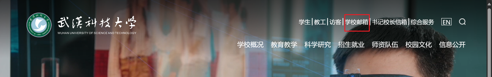
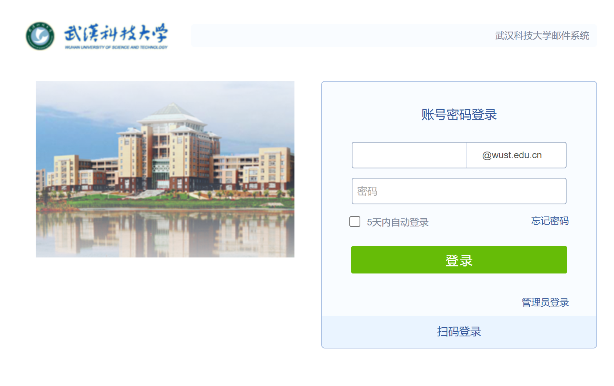

# 关于科大邮箱


\=Locked=

本页面已不接受新的修改请求。


## 为什么使用校园邮箱

1. 校园邮箱以学校域名为邮箱后缀，是学生身份的标识。
   1. 教学与科研活动中应使用edu邮箱。
   2. 论文投稿应使用edu邮箱。
2. 校园邮箱投递邮件不易被当成垃圾邮件被屏蔽。
3. 通过校园邮箱便于获取学生优惠。
   1. Github学生包-GitHub Education [访问链接](https://education.github.com/discount\_requests/application?type=student)
   2. Notion笔记学生认证-Notion for education [访问链接](https://www.notion.so/product/notion-for-education)
   3. Jetbrains免费教育许可证- [访问链接](https://www.jetbrains.com/zh-cn/community/education/#students)

## 武汉科技大学邮件系统入口

### 访问入口

#### 1. 直链

```
Link : http://mail.wust.edu.cn/
```

#### 2. 官网入口

<figure><figcaption><p>武汉科技大学官网</p></figcaption></figure>

### 邮件系统页面

<figure><figcaption><p>邮件系统</p></figcaption></figure>

若有邮箱账号，请选择**账号密码的登录方式**，登录后输入正确的账号密码登录即可。

若无邮箱账号，请在**企业微信-工作台-网上办事大厅-在校学生邮箱申请**中申请。

> 可参考[武汉科技大学-网络信息中心-申请校园邮箱的方法](https://its.wust.edu.cn/info/1201/1551.htm)
